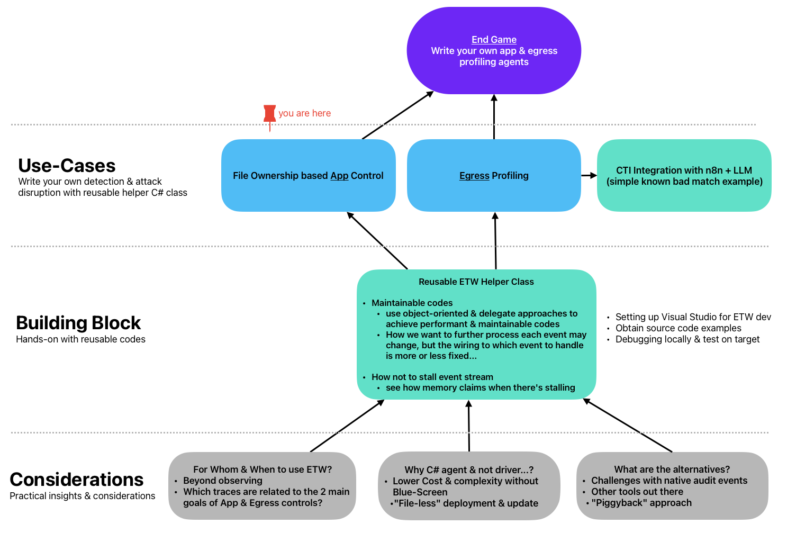
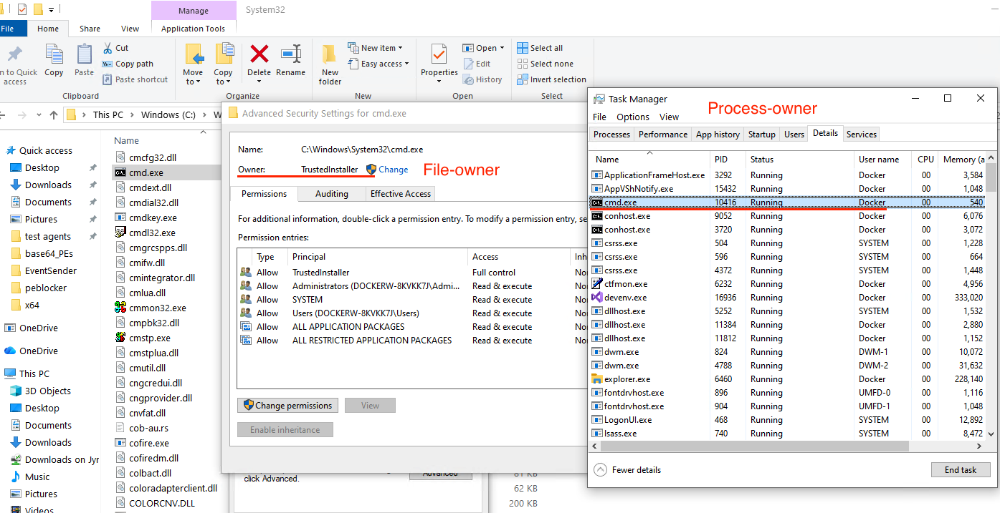
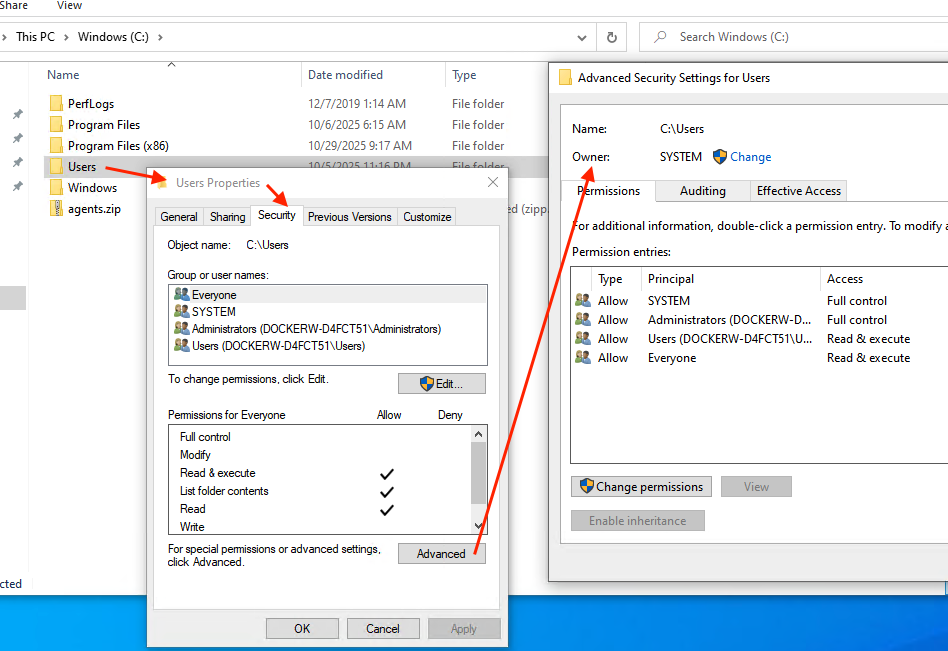
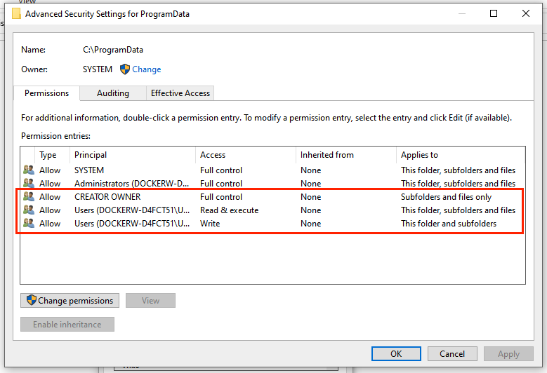
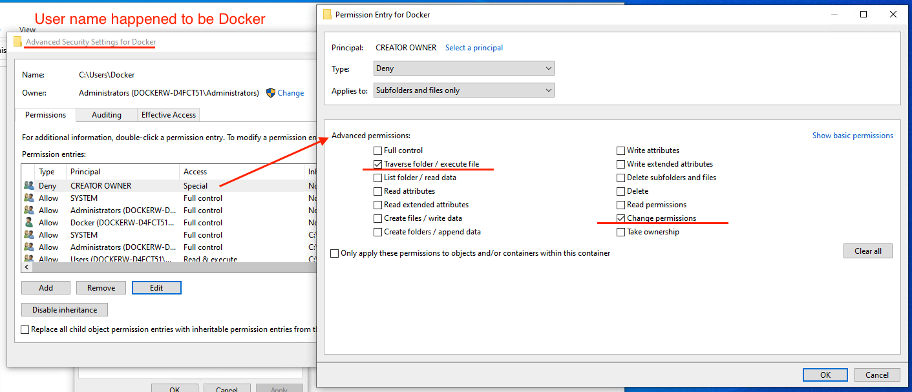
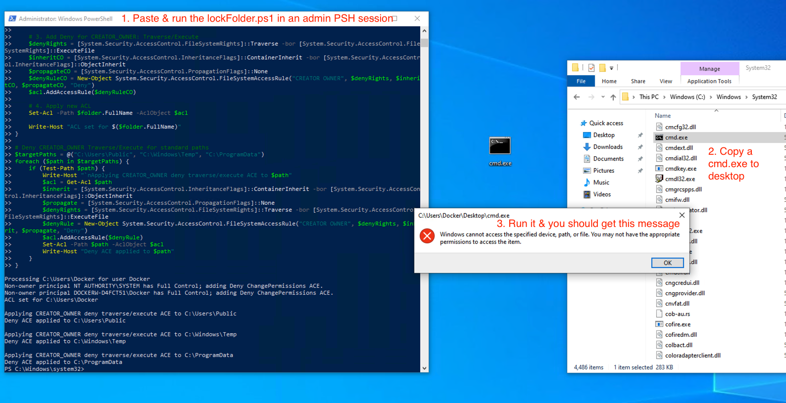

## Roadmap Recap

This is a continuation from ETW Helper Class, specifically [ProcessStart](../ETW%20Helper%20Class/ProcessStart/README.md) example.

## Background 
You need to "install" this Code Execution mental model before we proceed. 

>A mental model (MM) is a simplified internal representation of how something works or how the world operates. It aids comprehension, reasoning, and decisions making for complex situations.

### Code-Execution - keep it easy as Type 1 2 3
Short version (Longer version: https://jym.sg/mental%20models/Code%20Execution/):
- A quick grasp of Code-Execution, applicable to most OS but we are concentrating on Windows here.
- As a lense to review controls/defensive-products & technical reports, for instance... 
  - knowing what the defensive product is good/lousy at. E.g. is it mainly dealing with Type 1 like Anti-Virus?
  - does the report illustrate a scenario that uses Type 1 & by having App Control, the kill-chain would been disrupted. **Or is it truly novel that it can circumvent your current controls?**
- Devise _sustainable_ countermeasures; _low cost for us but much higher cost for attackers_
  

| **Types** | **Characteristics** | **Examples** |
|-------------------------|----------------------------------|----------------------------|
| Type 1 | Write & run executable files | Portable Executables written to disks: EXE, DLL... |
| Type 2 | Living off the land | Abusing native programs & services, OS mechanisms... |
| Type 3 | Exploit-Driven | Causing system error or exceptionhandling to run injected codes... |

### Why 3, not 4 or more?
There are numerous taxonomies (which are also forms of MM) and even attempts to enumerate & categorize different attack techniques into frameworks like MITRE ATT&CK. However, such taxonomies are taxing to most brains & a challenge to remember for most mortals. As such, we (my former Test-&-Evaluation group) developed a mental model that is practical and useful in a working environment.

Reductionist approach to group how typical general purpose OSes load & run codes: 
- It is either in executable code files format or it is not. 
- Executable code files can be either "native" or newly introduced (i.e. written to disk to run Type 1). 
- When it is NOT using executable file, then the codes have to come from somewhere & need to be interpreted by something within the target; could be an existing program, service or OS mechanisms (Type 2 abuses OS features).
- Finally, there will be ways to inject code fragments by illegimate means that are not based on features like Type 1 or 2, but based on logic issues aka bugs, Type 3.

>In Windows, this so-called executable code file format is known as Portable Executables or PE. Linux, macOS, and various OSes have their respective equivalents. Different code execution types can be "chained" together, from one form leading to another. This chaining aspect is one of the Achilles Heels of offensive code execution.


### Why reducing to 3 Code-Execution types matters?
Most products work at either the artifact or technique level. For instance, an antivirus tries to scan files as they're being written, comparing them against signatures. But some host agents use a different approach, analyzing system behaviors triggered by offensive techniques.

>Considering the three types of Code-Execution, let us pose a more ambitious question: is it feasible to implement a cost-effective and low-maintenance control mechanism that effectively blocks a substantial number of Type 1 executions, without the need for signature matching or heuristic monitoring?

That question is significant because, quantitatively, distinct files count of Type 1 (written PE files) malware surpasses the combined number of distinct exploits (Type 3) and system abuse techniques (Type 2) altogether! Some reports suggest file-based malware still represents over 90% of distinct observed attacks by volume, leaving exploit-based (Type 3) or Living-off-the-Land (Type 2) techniques as a much smaller share, often below 10%. Ransomware for instance are almost 100% PE file-based for the sake of encryption performance & campaign success.

This brings us to the actual topic of Application Control.

## What is App Control?
>App Control is the ability to control what programs are allowed to run on the system.

Examples: Microsoft Software Restriction Policies, AppLocker to Windows Defender Application Control. Ivanti Application Control & pioneering product like Bit9 App Control.


## Why App Control or Why NOT?
>Maintaining a bad-list that is potentially infinite is unsustainable, App Control blocks cheap permutations of written malware PE files.

Sounds good in theory but the challenges in practice:
- Evade by Type 2 & 3 techniques
- Maintaining bad-lists for customers is a more appealing proposition than for customers to purchase yet another product and still have to maintain good-lists themselves!
- Native Windows implementations are quite complex & fragmented

The following table provides a perspective on controls in relation to three types of code execution:


| **Endpoint Controls** | **Type 1: Write New PE File to execute** | **Type 2: Living Off The Land** | **Type 3: Exploit-Driven** |
|---------------------|-------------------------|----------------------------------|----------------------------|
| **Anti-Virus (bad-list)** | ⚠ Blocks known bad with signatures but malware mutation is free & voluminous | ✗ Weak (fileless/Non-PE, in-memory) | ✗ Useless (0-day exploits) |
| **Application Control (default deny)** | ✓ Blocks when NOT in allow-list | ✗ Bypassed (DLL side-loading, scripting & legit commands abuses) | ✗ No protection |
| **Driver-based EDR** | ⚠ Monitors behavior (evaded by direct syscalls, unhooking) | ⚠ Disarmed by signed drivers, OS tools... | ⚠ Monitors behavior (partial visibility) |
| **Ring-fencing with Moving-Target agents** | ✓ Deny written PE, NO easy loop-holes (e.g. need privilege escalation to run) & eliminate tedium of allow-list management | ✓ Disrupts C2, payload delivery & lateral movement (e.g. fileless) | ✓ Disrupts C2, payload delivery & lateral movement |

The sample codes & materials are mainly related to the last row... Here we talked about having App Control as the 1st fence. The other topic relates to Profiling, which is a 2nd fence.

## How to achieve App Control?
### Driver based
A driver is simply a special code file that is loaded very early in the boot sequence and has the highest (Kernel) or very high (User-mode) priority (than usual processes). We won't go in-depth here but just briefly highlight key points:
  - Most host products/controls are driver based.
  - Expensive to develop & maintain from a product development perspective.
  - Very static in nature such that adversaries can buy & reverse engineer to disarm products.
  - Vendor mistakes like the CrowdStrike incident is not new, just at a smaller scale for smaller.
  players.
  - From customer perspective, may need to maintain lists of allowed directories, specific file paths & so on.

### Loop-holes & Challenges to Overcome
The main downsides to improve upon:
- To deny easy & widely known loop-holes
- To eliminate tedium of allow-list management
- Deal with BYOVD (Bring Your Own Vulnerable Driver), which refers to the practice of attackers bringing vulnerable drivers and installing them into target systems to disable App Control product drivers.

### Non-Driver Approach
>Which is why we should consider a non-driver approach to App Control. Essentially a light weight agent that is not that static in nature; unique per deployment.

So how does it work? There are actually two aspects to protecting the endpoint:
1. Disrupt the vectors in terms of Type 1 Code-Execution, specifically this write-then-run chain
2. Not being disarmed by a vulnerable kernel driver, which will not be covered here.

>_The main idea is to overcome the challenges with App Control so that we can deal with Type 1 which forms the bulk of the payloads, in a sustainable way._ 

I also want to take the opportunities to touch on light weight agents over costly and static Windows driver approach.

## File-ownership Approach to App Control
> This code example illustrates a file-ownership approach to App Control...

Benefits of file-ownership approach
- Denies common evasions
- Avoids administrative effort & friction, no list to manage, just change the file ownership as a form of correction or mitigation.

Before we dive deeper in this approach, let's us first understand what are the comon evasions with conventional "listing" approach.  

### Abuse Allowed Programs or Mechanisms
Type 2 offensive techniques essentially abuses OS mechanisms and system programs, which are by typically included in the "allowed-list". Consequently, these programs running off such "allow-listed" folders can indirectly execute malicious code or directly interpret malicious scripting. 

A common example would be along `rundll32 NotAbad.dll,MyC2function`. `rundll32.exe` is required for legitimate system functions, and files like `NotAbad.dll` are usually written into user-writable folders. Once such DLLs are written into allowed paths that are also user-writable, the malware will run unhindered. 

### Fileless Techniques
The earlier example requires a written DLL file to disk & there's a chance to be caught by AV. By abusing scripting like Powershell, attackers can load DLL from remote store into target host memory & execute _without ever writing to disks_, evading App Control &/or AV altogether. Fileless can be achieved with either Type 2 or 3 methods by writing to memory instead of disks.

### File ownership is NOT Process ownership
File ownership and process ownership are distinct concepts in operating systems and security. File ownership refers to the user or account that has control over a file’s permissions, such as reading, writing, or executing that file—it determines who can modify or access the file’s contents. 

Process ownership, on the other hand, refers to the user or account under which a running process operates, determining the privileges that process has while executing code.



For instance, the `file` cmd.exe located within `C:\Windows\System32` is owned by `TrustedInstaller`, but the running process is owned by user `Docker` as shown above. You may not own the file, but you can run it under your privilege or session context. More importantly...

>Standard User cannot take ownership of files NOT owned by them. Only Administrators (or accounts with SeTakeOwnershipPrivilege) can _take ownership_ of files NOT owned by them.

## Deny Type 1 without Using Drivers
### Deny-on-Write
NTFS refers to the file system of Windows. NTFS allows you to control access to files and folders. You can deny or allow access to a file or folder by using NTFS permissions.

>If offensive circles have the notion of Living-Off-the-Land for attacking system, then defenders should also maximise native system capabilities to reduce the chance of being attacked.

Just to recap, a malware process running under user's context (e.g. a docx with malicious macro or LNK pointing to malicious scripting) will write PE (Type 1) owned by that user.  There are numerous techniques like DLL-sideloading using legitimate (but problematic) EXEs to load bad DLLs. _Regardless of the PE files & launch variations, they all conform to this "write-&-run" approach._

All these typically occur within user-writeable folders. Such techniques can evade App Control, which may not enforce DLL checks due to performance concerns because most EXEs load numerous DLLs during launch. To avoid performance impact, modern driver-based host control products can selectively inspect DLLs, but that also means there's usually some forms of signatures and/or behavior to look out for. Persisting the proverbial "Cat-vs-mouse" game of chasing after "bad" software. 

>To break this Cat-vs-Mouse game, the fundamental idea is that we don't trust PE files owned by users. By adopting a file ownership approach with NTFS ACL rules, we can disrupt the write-&-run tactic without compromising performance & achieve deterministic protection. The aim is to minimise disruption to legitimate software by fixing their PE file ownership.

Since we don't trust PE files owned by users, which files can we trust? The following Powershell script allows you to verify for yourself which groups or individuals own EXE and DLL files. You need to run under Administrator PSH session:

```powershell
# Initialize an empty hash set (as a [HashSet[string]] for efficiency in PS 7+, or use an array for compatibility)
$existingUsers = @{}

Get-ChildItem -Path 'C:\' -Recurse -Include *.exe,*.dll -File -ErrorAction SilentlyContinue | ForEach-Object {
    try {
        $owner = (Get-Acl $_.FullName).Owner
        if ($owner -and -not $existingUsers.ContainsKey($owner)) {
            Write-Output $owner
            $existingUsers[$owner] = $true
        }
    } catch {
        # Skip files that cannot be accessed
    }
}

```

You will likely see these 3 listed out first:
- BUILTIN\Administrators
- NT SERVICE\TrustedInstaller
- NT AUTHORITY\SYSTEM

Followed by whatever user names that are on that system. `Administrators` is administrator-group while the other 2 are built in Principals, think of them as special "users" that you won't use to logon. Only `SYSTEM` runs services & system processes like what you may see in Task Manager. There are transient system processes that run under `TrustedInstaller` but such program files (typically system update installers) are **unlikely** from the paths stated in the next table.

>**Now that we know which file owners to trust, then how & what kind of NTFS ACL rules can we apply & which folders to apply to?**

| Folder Path                                     | Usage Type                | Notes                                |
| ----------------------------------------------- | ------------------------- | ------------------------------------ |
| C:\\Users\\Public\\                             | Drop/Execute/Persist      | Accessible by all users              |
| C:\\ProgramData\\                               | Drop/Execute/Persist      | Hidden, user-writeable               |
| C:\\Users\\[username]\\AppData\\Local\\           | Drop/Execute/Persist      | Per-user/local files                 |
| C:\\Users\\[username]\\AppData\\Roaming\\         | Drop/Execute/Persist      | Roams w/ profile, widespread abuse   |
| C:\\Users\\[username]\\AppData\\Local\\Temp\\     | Initial staging/Execution | Cleared on reboot, frequently abused |
| C:\\Users\\[username]\\Desktop\\                  | Social engineering/Drop   | Visible to user, less stealth        |
| C:\\Users\\[username]\\Documents\\                | Drop/Social engineering   | For disguised payloads               |
| C:\\Users\\[username]\\Start Menu\\Programs\\Startup\\ | Persistence (auto-run)    | Runs at user login                   |

The table can be further reduced to all child folders (e.g. specific user folder) under `C:\Users` & `C:\ProgramData`. But if you drilled in to see who actually owns `C:\Users`, right click the folder -> Properties -> Security -> Advanced... you will likely find:



& for `C:\ProgramData`:



These folder access control rules are important because we are going to deny `Creator Owner` from `Traverse/Execute` & the rules will be inherited the moment PE files are written. If you were to look at your Task Manager, it is _unlikely_ that you will find any **process** owned by `SYSTEM` or `TrustedInstaller`, launched from a **file** owned by any standard user, stored within `C:\Users...` or `C:\ProgramData...`, unless one deliberately does so with Scheduled Tasks or tools like PSExec.



This `Traverse/Execute` rule is a special rule that denies the owner from executing PE files. However, since each child folder (except for Public) under `C:\Users` "belongs" to the respective user due to the allow Full Control rule, we need another deny rule to prevent standard users from removing this special `Traverse/Execute` rule. This also means attackers need to escalate to at least a Local Administrator account (e.g. with UAC bypass) to remove these rules, which is typically not the case during initial intrusions.

>This repository contains a Powershell script that adds these rules programmatically (*PLEASE USE IT ON A TEST VM*), instead of doing it manually using Explorer.

Regardless how the rules are added, the net effect of blocking PE files is demonstrated below:



>This simple folder NTFS rule will break different type chaining (e.g. Type 3 launches Type 2 then 1...) so long it involves a write-then-run PE (i.e. Type 1). The main concern becomes: _What if there are more folders that are user writeable and not subjected to this deny Traverse/Execute rule?_

Which is the reason why we need to look at _Deny-after-Launch_ approach.  

### Deny-after-Launch
You will notice that [lockFolders.ps1](lockFolders.ps1) is adding rules to a set of folders that are mentioned earlier in the table of commonly abused folders for malware drop-&-run. There could be more folders that have user-writable permission that are not included in this list.

To address those gaps, we are going to modify the ETW helper class [ProcessStart example](https://github.com/jymcheong/ETW-tutorialSet/blob/687aa2bc428b0df71e3ceb3cce2b3751b79d73fa/ETW%20Helper%20Class/ProcessStart/ConsoleApp1/Program.cs#L16) to check file-ownership AFTER the process starts:

```c#
void Handler_ProcessStart(ProcessTraceData obj)
{                                     // notice ImageFileName has NO PATH...
    Console.WriteLine($"\nPID {obj.ProcessID} {obj.ImageFileName} started");
    Console.WriteLine($"Cmdline: {obj.PayloadByName("CommandLine") }");
}

void Handler_ImageLoad(ImageLoadTraceData obj)
{
    if (obj.FileName.ToLower().IndexOf(".dll") > 0) return;
    // this shows EXE full path, skipping all DLLs
    Console.WriteLine($"PID {obj.ProcessID} {obj.FileName} started");
}
```

We have to change `Handler_ImageLoad` since `obj.ImageFilename` within `Handler_ProcessStart` does not contain full path. We can then check file ownership with `obj.FileName` (which has full path to file) & take the appropriate response action. To keep this exercise simple, we are only looking at EXE loads, not DLLs. 

```c#
void Handler_ImageLoad(ImageLoadTraceData obj)
{
    if (obj.FileName.ToLower().IndexOf(".dll") > 0) return;
    // We check file ownership EXE full path, skipping all DLLs for now
    try
    {
        if (IsTrusted(obj.FileName)) return;
        Console.WriteLine("UNTRUSTED: " + obj.FileName);
        Process.GetProcessById(obj.ProcessID).Kill();
    }
    catch (Exception ex) 
    {
        Console.WriteLine(ex.Message);
    }
}
```

This simple agent here will just kill any EXE process if the backing file is not owned by:
- BUILTIN\Administrators
- NT SERVICE\TrustedInstaller
- NT AUTHORITY\SYSTEM

The [file-ownership check](https://github.com/jymcheong/ETW-tutorialSet/blob/d1ec9c73c4d80378a5a37ce93e5353a625198d49/AppControl/FileOwner/ConsoleApp1/Program.cs#L28) is performed within `IsTrusted` method as shown above.

## Issues with file ownership approach
- Administrators with certain UAC settings such that files are immediately owned by `BUILTIN\Administrators`.
- Some apps that are owned by user will break (e.g. home edition of OneDrive & note its [malware persistence method](https://www.youtube.com/watch?v=tPVRVLr_rGk)), have to "fix" ownership for such files if we want them to run.
- Files blocked by NTFS rules don't emit any events unless we explicitly set audit rules for each file, which needs dynamic monitoring of newly written files to add such rule.

## Suitable Adoption Scenarios
- Facing challenges to keep AV signatures updated but still need to block malware.
- Limited resources, budget or expertise to lock down Windows endpoints or setup AppLocker or WDAC.
- Legacy System Hardening e.g. Win7 & soon 10.


