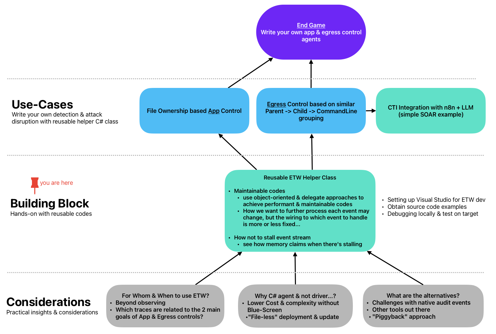

## Roadmap

## Overview
* Setup of development environment
* Explanation of the helper class design and usage
  
* Testing approaches

## Environment
You will need:
* Visual Studio Community 2022
* Win 10 or 11 with local admin rights

I won't drill into the step-by-step, use the easiest way for you to clone this repository and go into respective folders to look for solution files (.sln) to launch with Visual Studio.

## Design
### Why a Helper Class?

- New .NET features (especially in C# 9.0 and newer) make it more like scripting e.g. Main-less Program.cs (screenshot above) which you will also see in the source codes.
- Along with lambda functions, it becomes easier to [write more complex & hard to maintain codes](https://github.com/microsoft/krabsetw/blob/master/examples/ManagedExamples/UserTrace007_StackTrace.cs).
- **A new project would probably require a total rewrite or removal of most logic that has nothing to do with your new project**

>With a helper class, you don't need to copy-&-paste & delete codes that you don't need. You can focus on your core logic instead. Go to the helper class, just configure which ETW provider. More importantly, leverage object oriented approach for more maintainability.

### Why [`Microsoft.Diagnostics.Tracing.TraceEvent`](https://www.nuget.org/packages/Microsoft.Diagnostics.Tracing.TraceEvent/) & not [KrabsETW](https://github.com/microsoft/krabsetw) or C++/Golang/Rust...?
- Depends what are your priorities. *E.g. pressure to show something quickly?*
- Do you really need low-level control with things like KrabsETW which has native C++ codes & DLL to bundle with your program?
- Or do you just want to get things done with C# or even VB.NET that you are familar & proficient with?
 
>I will provide a short example in one of the code folders that demonstrates file-less ETW agent loading. This cannot be done with KrabsETW since we can't bundle native DLLs with managed agent(s). So that's one of my considerations when picking which ETW library to use.

### How to figure out which fields from which provider since there are SO MANY!!!?
>This in my opinion is the most challenging part of ETW development

This helper class and the examples organized in an object-oriented format will provide some guidance. The comments within the code will explain things further than writing everything in a README.

## Testing
* Visual Studio needs to Run-as Local Administrator for step debugging
