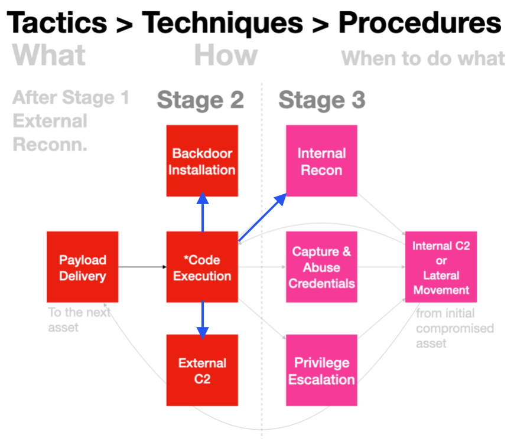

## Why Egress Matters?
Egress refers to the activities that happen when data leaves our network, whether it's going to the internet or within intranet. The question is, which process is responsible for these activities? 

>Could it be a system update that contacts Microsoft cloud infrastructure, or is it malware downloading more files to stay hidden?

## What typically happens after Code-Execution?
W.r.t to Tactics, Techniques & Procedures, the blue arrows below requires some form of network access:


Initial Code-Execution may:
1. report to C2 (Command & Control) server so that attackers know they got into target
2. download backdoors to install into the system

As part of reconnaisance, attackers may scan the internal network for next or more targets...

Going through the reports @ https://thedfirreport.com & the [likes](https://www.perplexity.ai/search/other-sites-like-https-thedfir-H0hUsCD4SdmEru6yvjomAg#0), you will notice that almost all incidents involving some sort of malware, will almost involve at least one of those boxes above, if not all. 

[Mitre](https://attack.mitre.org) has a comprehensive enumeration of techniques per tactic, but this post is not about taxonomy.

>This post is about when & how to take advantage of ETW tracing for network egress.

## What to look out for?
1. Which process is accessing network?
2. What/where is the destination?

## Why these two?
- We need to narrow down any offending process(es) & respond (e.g. kill it).
- Sometimes we can't outright block/delete certain programs like `cmd.exe` or `powershell.exe`, we will need to block the bad destinations at the host &/or network level with firewall rules.
- W.r.t to the earlier diagram, a backdoor process controlled via the Internet, that is scanning/accessing Intranet (e.g. org chart webpage) would **cover both external & internal destinations**, _how often does that occur in your environment & which program/process are involved?_

## How to track egress?
There's really no need for ETW when the objective is simply just recording for compliance or forensics.

Windows [audit event ID 5156 is your friend](https://www.perplexity.ai/search/how-to-turn-on-windows-audit-5-P.lrwnH2QHKOw6LUdOSD8g#0). 

>The main problem challenge is potentially huge event volume PER endpoint, multiply that by a population of Windows hosts in your environment.

## When will ETW be useful?
- Don't want to solely depend on COTS products because disarming them is becoming a norm.
- Want some automated response that COTS can't do.
- Want custom profiling of process-network events.

## What does the ETW examples cover?
- The simpler version (within this folder) introduces how to configure the ETW helper class to receive network events.
- The more complex version introduces how to use the ETW helper class to filter network events.