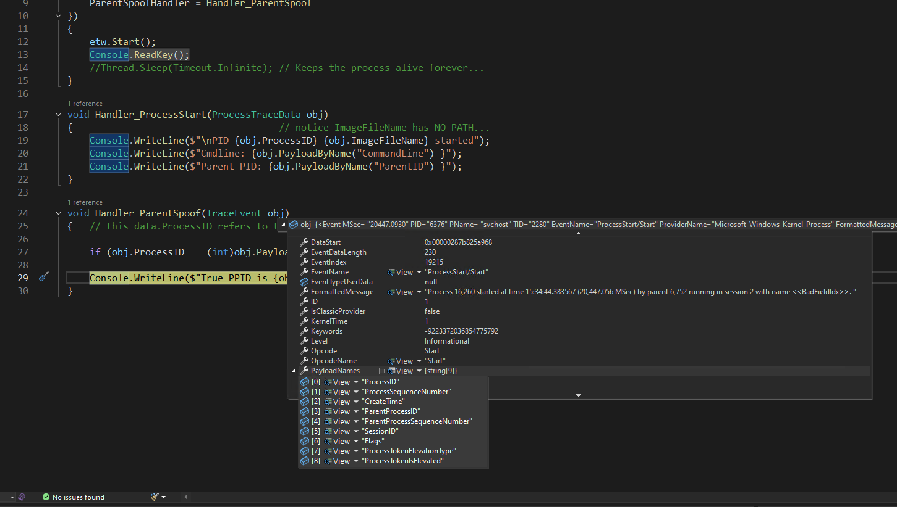

## Overview (What > Why > How)
This example extends from [ProcessStart example](../ProcessStart/README.md) to monitor parent process spoofing.
- We start off with **what** is parent spoofing & explain **why** it matters.
- After which, see **how** to use ETW to monitor parent process spoofing.

## What is it & Why it matters
Parent process spoofing involves manipulating the Windows process creation attributes so the new process appears to be spawned by a benign or privileged parent. Attackers typically use the `CreateProcess` API along with appropriate flags (or `UpdateProcThreadAttribute`) to set an arbitrary parent PID when launching malware, making detection more difficult since EDRs often flag malicious parent-child process relationships [2][7][5][8][1]. Parent Spoofing can be abused for EDR evasion and privilege escalation, but Windows also implements parent spoofing legitimately when elevating privileges via UAC dialogs.[1][2][3][4][5][6]

### Privilege Escalation Requirements
Parent process spoofing does not always require privilege escalation, but setting a SYSTEM-level process as the parent for a new process generally requires administrator or SYSTEM permission. Simple spoofing to confuse monitoring (e.g., making PowerShell look spawned by explorer.exe) does not need elevated privileges, but actual escalation hinges on ability to access the target parent's security token and permissions.[4][5][6]

### Legitimate Use in UAC Elevation
Windows legitimately uses parent process spoofing when User Account Control (UAC) elevates privileges. When an application requests elevation, the UAC system (notably `consent.exe` or the Appinfo service) sets the parent process ID for the elevated child process to the desktop shell (like explorer.exe), ensuring proper privilege inheritance and a coherent process tree for elevated tasks. This keeps process lineage sensible for security and usability reasons.[3][4]

### EDR Evasion and Abuse
Attackers abuse parent process spoofing to make malware appear as if it originated from trusted or innocuous processes, thereby bypassing EDR rules that monitor suspicious process chains. For example, a macro in Office might launch malicious code and spoof explorer.exe as its parent, masking the phishing technique and thwarting markov-linked process detection. More dangerously, attackers with high privileges may spoof SYSTEM or lsass.exe as parent, causing the malicious process to inherit elevated access tokens and defeat EDR privilege boundary enforcement.[9][5][8][6][10][2][4]

### Summary Table: Parent Process Spoofing Aspects

| Aspect                  | Legitimate Use (UAC) [3][4] | EDR Evasion/Abuse [2][8][10] |
|-------------------------|--------------------------------------|--------------------------------------------|
| Mechanism               | Set parent PID via system API        | Set parent PID via same APIs               |
| Requires privilege?     | Only for SYSTEM-level elevation      | Yes for privilege escalation, not always   |
| Security impact         | Proper privilege inheritance         | Confuses monitoring, enables escalation (e.g. UAC bypass)    |
| Classic example         | Elevated process appears from shell  | PowerShell spawned by explorer.exe (user shell)        |
| Abuse detection         | Check for unexpected PPIDs           | Monitor for anomalous parent-child pairs   |

This technique leverages inherent Windows features for both legitimate user experience and malicious evasion or escalation, requiring defenders to monitor process lineage closely and correlate with user context and endpoint state.[11][5][10][1]

## How to use ETW to report parent process spoofing
- Standard audit events like 4688 or even Sysmon ProcessCreate DO NOT report parent process spoofing.
- When it comes to evasion, parent spoofing is also used with commandline spoofing (will revisit under CrossProcess example).
- Detecting parent spoofing also helps establish UAC bypasses, which is mentioned in the previous table.

> The sample codes simply reports parent spoofing, but it doesn't have the logic to determine whether it is good or bad. It is to illustrate how we extend from the ProcessStart ETW example to monitor parent process spoofing, highlighting the need for at least 2 ETW providers for a complete picture of parent spoofing. 

### Main differences from ProcessStart example
- Removed ImageLoad handler since we are not concern with DLLs.
- Added ParentSpoofHandler to monitor parent process spoofing.

Remember to start Visual Studio as Local Administrator to run ETW codes for debugging/testing. You may also set a breakpoint into ParentSpoofHandler after the if clause:

Once you start a powershell session similar to what was shown in the gif, you should hit that breakpoint.

>You should also notice that the true PPID for consent.exe is the same as powershell or any process that you UAC elevate to run.

### Need Two ETW Providers

- There are two different ETW providers: MSNT_SystemTrace vs Microsoft-Windows-Kernel-Process
- The former has CommandLine attribute, similar to what you have seen in ProcessStart example
- The latter doesn't have CommandLine but has true PPID

Drill into PayloadNames & notice no CommandLine...

>To report a complete picture of parent spoofing, you will need two ETW providers!

## References

- [[1] https://www.elastic.co/docs/reference/security/prebuilt-rules/rules/windows/defense_evasion_parent_process_pid_spoofing](https://www.elastic.co/docs/reference/security/prebuilt-rules/rules/windows/defense_evasion_parent_process_pid_spoofing)
- [[2] https://trustedsec.com/blog/ppid-spoofing-its-really-this-easy-to-fake-your-parent](https://trustedsec.com/blog/ppid-spoofing-its-really-this-easy-to-fake-your-parent)
- [[3] https://infosecwriteups.com/bypassing-uac-1ba99a173b30](https://infosecwriteups.com/bypassing-uac-1ba99a173b30)
- [[4] https://viperone.gitbook.io/pentest-everything/everything/everything-active-directory/access-token-manipultion/parent-pid-spoofing](https://viperone.gitbook.io/pentest-everything/everything/everything-active-directory/access-token-manipultion/parent-pid-spoofing)
- [[5] https://attack.mitre.org/techniques/T1134/004/](https://attack.mitre.org/techniques/T1134/004/)
- [[6] https://d3fend.mitre.org/offensive-technique/attack/T1134.004/](https://d3fend.mitre.org/offensive-technique/attack/T1134.004/)
- [[7] https://www.ired.team/offensive-security/defense-evasion/parent-process-id-ppid-spoofing](https://www.ired.team/offensive-security/defense-evasion/parent-process-id-ppid-spoofing)
- [[8] https://www.linkedin.com/pulse/updateprocthreadattribute-hidden-lever-behind-process-dana-behling-ce8lf](https://www.linkedin.com/pulse/updateprocthreadattribute-hidden-lever-behind-process-dana-behling-ce8lf)
- [[9] https://www.withsecure.com/en/expertise/blog-posts/dechaining-macros-and-evading-edr](https://www.withsecure.com/en/expertise/blog-posts/dechaining-macros-and-evading-edr)
- [[10] https://www.microsoft.com/en-us/security/blog/2022/06/30/using-process-creation-properties-to-catch-evasion-techniques/](https://www.microsoft.com/en-us/security/blog/2022/06/30/using-process-creation-properties-to-catch-evasion-techniques/)
- [[11] https://www.elastic.co/docs/reference/security/prebuilt-rules/rules/windows/privilege_escalation_via_ppid_spoofing](https://www.elastic.co/docs/reference/security/prebuilt-rules/rules/windows/privilege_escalation_via_ppid_spoofing)
- [[12] https://www.picussecurity.com/resource/blog/how-to-detect-parent-pid-ppid-spoofing-attacks](https://www.picussecurity.com/resource/blog/how-to-detect-parent-pid-ppid-spoofing-attacks)
- [[13] https://docs.velociraptor.app/blog/2021/2021-09-03-process-spoofing/](https://docs.velociraptor.app/blog/2021/2021-09-03-process-spoofing/)
- [[14] https://www.elastic.co/guide/en/security/8.19/parent-process-pid-spoofing.html](https://www.elastic.co/guide/en/security/8.19/parent-process-pid-spoofing.html)
- [[15] https://www.elastic.co/guide/en/security/8.19/privileges-elevation-via-parent-process-pid-spoofing.html](https://www.elastic.co/guide/en/security/8.19/privileges-elevation-via-parent-process-pid-spoofing.html)
- [[16] https://www.volexity.com/wp-content/uploads/2024/08/Defcon24_EDR_Evasion_Detection_White-Paper_Andrew-Case.pdf](https://www.volexity.com/wp-content/uploads/2024/08/Defcon24_EDR_Evasion_Detection_White-Paper_Andrew-Case.pdf)
- [[17] https://www.withsecure.com/userguides/product.html?business%2Fedr%2Flatest%2Fen%2Fprivilege_escalation-latest-en](https://www.withsecure.com/userguides/product.html?business%2Fedr%2Flatest%2Fen%2Fprivilege_escalation-latest-en)
- [[18] https://www.elastic.co/guide/en/security/8.19/parent-process-detected-with-suspicious-windows-process-es.html](https://www.elastic.co/guide/en/security/8.19/parent-process-detected-with-suspicious-windows-process-es.html)
- [[19] https://detection.fyi/elastic/detection-rules/windows/defense_evasion_parent_process_pid_spoofing](https://detection.fyi/elastic/detection-rules/windows/defense_evasion_parent_process_pid_spoofing/)
- [[20] https://attack.mitre.org/techniques/T1548/002/](https://attack.mitre.org/techniques/T1548/002/)

