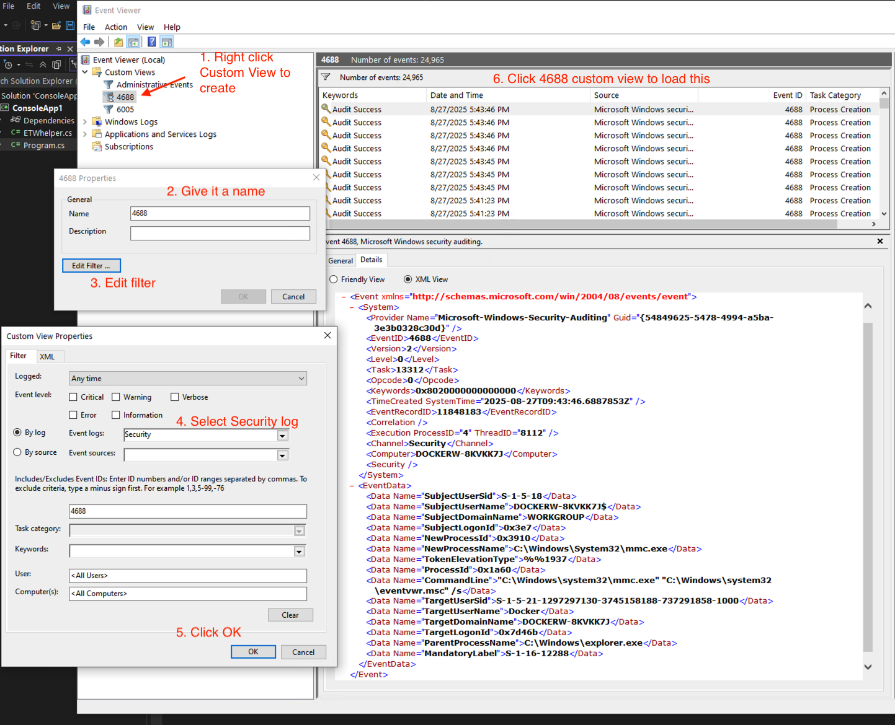

## What is it doing?
- Process start events NOT shown in Windows Event Viewer.
- This simple example shows PID (Process Identifier), file name (no path), and command line arguments & finally full path within ImageLoad event handler.
- If you remove the if line that filters out DLL paths, you will see the amount of DLLs that are loaded per process.

## What to look out for?
- Look at the event volume (how many lines printed out from the example Console app) before/after removing the DLL filter line
- Did ProcessStart handler provide full path? 
- [Which trace provider](https://github.com/microsoft/krabsetw/blob/master/docs/UsingMessageAnalyzerToFindETWSources.md) for what?

## What else can you try?

- [Turn on 4688 audit event](https://www.perplexity.ai/search/i-need-powershell-commands-to-OZzHDW9TQmSRJGO_YbJ8CQ) & look at Windows Event Viewer
- You can also try Google / AI tools to see if you turn on security audit for DLL loads; you won't find such audit event because there's none.
- Look at the constructor for the helper class
- That class is a building block example towards Application Control with ETW in a later part of the series.

https://github.com/microsoft/krabsetw/blob/master/docs/UsingMessageAnalyzerToFindETWSources.md is an excellent resource to learn how to use Microsoft Message Analyzer to find new ETW Sources!

### Learn from specific context
In this case, let's look at ransomware. As adversary, you would want to ensure the endpoint cannot recover from backup.
- Volume Shadow Copies (aka VSS or Volume Shadow-Copy Service), native backup within Windows Systems would be prime target for deletion before encryption begins.
- Now that you can in real time monitor for process start, you can also monitor for volume shadow copy deletion.
- Do some research e.g. https://www.perplexity.ai/search/give-me-all-the-vss-shadow-del-TbdUVJkcQImTzu3Z16krgA

Here are all main permutations and methods to delete Volume Shadow Copies (VSS shadow copies) on Windows systems, including command-line, PowerShell, WMI, and other techniques.

| Method                  | Example / Syntax                                         | Commandline String Detectable | Notes                                    |
|-------------------------|----------------------------------------------------------|------------------------------|------------------------------------------|
| vssadmin /for=/all      | vssadmin delete shadows /for=C: /all                     | Yes                         | Easy to detect via “vssadmin delete”      |
| vssadmin /for=/oldest   | vssadmin delete shadows /for=C: /oldest                  | Yes                         | Same as above                            |
| vssadmin /shadow=       | vssadmin delete shadows /shadow={ShadowID}               | Yes                         | “vssadmin delete” is visible             |
| vssadmin /all           | vssadmin delete shadows /all                             | Yes                         | “vssadmin delete shadows /all” is clear  |
| wmic                    | wmic shadowcopy delete                                   | Yes                         | “wmic shadowcopy delete” string caught   |
| wmic by ID              | wmic shadowcopy where ID="{ShadowID}" delete             | Yes                         | “wmic shadowcopy” string present         |
| PowerShell WMI          | Get-WmiObject Win32_ShadowCopy \| ForEach { $_.Delete() }| Yes                         | “Get-WmiObject Win32_ShadowCopy” or “Delete()” can be matched[3] |
| PowerShell CIM          | Get-CimInstance -Class Win32_ShadowCopy \| Remove-CimInstance| Yes                     | “Remove-CimInstance Win32_ShadowCopy” matches[3]     |
| COM API (IVssCoordinator)| C++/C# code (no commandline)                            | No                          | Not visible in commandline logs          |
| diskshadow utility      | diskshadow → delete shadows all                          | Yes                         | “delete shadows all” appears in process args             |
| GUI / Disk Cleanup      | GUI, not command-line                                    | No                          | Only visible via process or user monitoring              |

>Notice there are only two approaches that cannot be detected via commandline string. 

For those that can be detected via commandline string, notice `shadow` & `delete` are the keywords (lowercase the string for substring matches) that present for all of them. Be mindful that characters like `^` (for cmd.exe) & Powershell concatenation operators like `+` can be used to obfuscate commandline string against simple substring matching. Edit distance functions will be useful here. 

### What's defenders' next best move?
>Since the attack does a delete, your ETW agent just simply run a backup again. The malware logic most likely will still thinks it has successfully wiped the shadow copies.

So even encryption were to be successful, the snapshot would be most recent (modern hardware takes 10-30 seconds to create snapshot btw), just before the encryption begins. 

You can even go one step further to kill whatever that initiated the vss wipe, but bear in mind that the parent of vss deletion could be a transient process like `cmd.exe` or `powershell.exe`, and not the ransomware process itself.

# Next
You may want to look at the topic of [Parent Spoofing](../ParentSpoof/README.md)!
