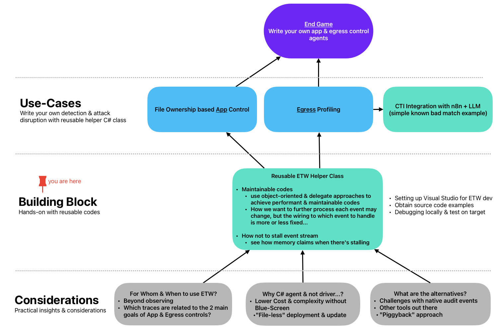

## Roadmap

## Overview
* Setup of development environment
* Explanation of the helper class design and usage
  
* Testing approaches

***

## Environment
You will need:
* Visual Studio Community 2022
* Win 10 or 11 with local admin rights

I won't elaborate on how to set up the development environment, use the easiest way for you to clone this repository, then explore respective folders to look for solution files (.sln) to launch with Visual Studio.

***

## Design
### Why a Helper Class?

- New .NET features (especially in C# 9.0 and newer) make it more like scripting e.g. Main-less Program.cs (screenshot above) which you will also see in the source codes.
- Along with lambda functions, it becomes easier to [write more complex & hard to maintain codes](https://github.com/microsoft/krabsetw/blob/master/examples/ManagedExamples/UserTrace007_StackTrace.cs).
- **A new project would probably require a total rewrite or removal of most logic that has nothing to do with your new project**

>This helper class is an example of how codes can be organised in an object-oriented manner that uses event handlers. 

***

### Why [`Microsoft.Diagnostics.Tracing.TraceEvent`](https://www.nuget.org/packages/Microsoft.Diagnostics.Tracing.TraceEvent/) & not [KrabsETW](https://github.com/microsoft/krabsetw) or C++/Golang/Rust...?
- Depends what are your priorities. *E.g. pressure to show something quickly?*
- Do you really need low-level control with tools/libraries like KrabsETW which has native C++ codes & DLL to bundle with your program?
- Are you going to maintain it or you need to transfer to another group (which is easier for you or them)?
- Or do you just want to get things done with C# or even VB.NET that you are familar & proficient with?
 
>I will provide a short example in one of the code folders that demonstrates file-less ETW agent loading. This cannot be done with KrabsETW since we can't bundle native DLLs with managed agent(s). So that's one of my considerations when picking which ETW library to use.

### How to figure out which fields from which provider since there are SO MANY!!!?
>This in my opinion is the most challenging part of ETW development. [Perplexity Pro](https://perplexity.ai/pro?referral_code=P3U9A1TE) is your friend...

This helper class and the examples are organized in an object-oriented format. The comments within the code will explain further.

***

## Testing
Note the following:
* Visual Studio needs to Run-as Local Administrator to run ETW codes for debugging/testing
* Look at memory & CPU profiles in Task Manager, Perfmon or within Visual Studio debugger
* Avoid event handler routine that has blocking calls (e.g. write to disks like logging, network calls, etc...)
* Push or deploy to a remote machine to test for stability & reliability.

## What's Next
I will update & add more code examples along the way, now we start off with a simple example of [process-start monitoring](ProcessStart/README.md).