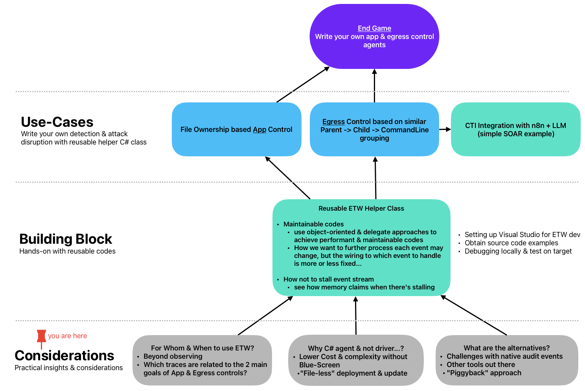

## What is this series about & who is it for?  
This series is for professionals who already understand Event Tracing for Windows (ETW) and work in technical roles such as:  
- Security product developers/engineers  
- Threat hunters and malware analysts  
- System programmers looking to pivot into security  
- Product managers/architects designing product capabilities  

This is not a step-by-step ETW tutorial, but a deep dive into practical, advanced uses of ETW beyond audit log collection.  

***

## When to use ETW?  

### Beyond audit logging data-sets 
Windows audit events are often enough for basic detection and accountability. In such cases, ETW development isn’t worth the overhead.  

ETW agent development makes sense when you need to:  
- Correlate different event types, e.g., link process creation details with its network egress activity.  
- Handle detection scenarios where audit data is insufficient:  
  - True Parent ProcessID is absent in EID-4688 and even Sysmon.  
  - File access auditing typically needs per-resource setup; even with Global Object Access Auditing, capturing everything for backend processing is impractical.  
- Reduce backend complexity and storage costs by pushing processing to endpoints. 

I will show & explain how to repurpose certain “fileless” offensive techniques to simplify agent deployment and updates.  

***

### Near real-time response  
ETW provides the data to decide when to trigger actions on the endpoint instantly, either directly from events or after light on-device correlation, avoiding the need to send a firehose of data to a backend.

This series will show how to use ETW for near-real-time application and egress control, using high-level C# code, not kernel-level development.  

***

## Why C#?  
- Lower learning curve than driver development  
- Easier to maintain  
- No driver signing costs  
- No BSOD risk (that brought global IT down) since we stay out of kernel space  

We’ll also show how to turn any C# console app into a SYSTEM process, and discuss the weaknesses of the common driver-based approach and how to overcome them with a simpler method.  

***

## Alternatives  
### Windows Audit Events  
For near-real-time response, audit events suffer from latency. But if your use case tolerates delays, you can achieve results with just a few lines of C#, also covered in this series.  

### Sysmon

Sysmon excels as a monitoring tool when you need visibility beyond basic process creation and termination (like EID 4688 and 4689). It provides deep telemetry, such as detailed network connection events, that are otherwise unavailable through standard audit facilities. This series also includes an example of interacting directly with the Sysmon ETW provider, enabling you to tap into Sysmon's events programmatically for advanced correlation, custom detection, and near real-time response scenarios.

### Non-Microsoft Options

There’s no shortage of open-source ETW projects on GitHub, but one project stands out for its polish and active development: **Fibratus**. [Fibratus](https://github.com/rabbitstack/fibratus) is purpose-built for adversary detection, protection, and threat hunting using ETW. It covers a wide spectrum of system activity, provides a flexible detection rule engine, and supports real-time and forensic workflows. The project is mature, well-maintained, and highly extensible—making it a strong alternative or complement to Sysmon for advanced defenders and developers seeking maximum control over system event instrumentation.

## What's Next?
The next entry in this series will be on **Reusable Helper Class**. It will cover:
* Setup of development environment
* Explanation of the helper class design and usage
* Testing approaches

Do follow/fork this on Github or connect @ [LinkedIn](https://www.linkedin.com/in/jymcheong/)!